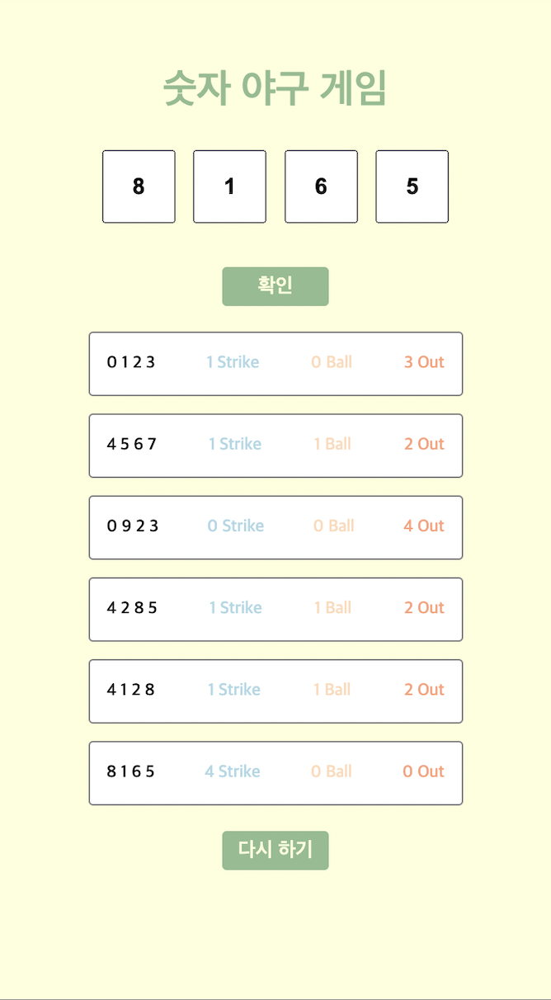
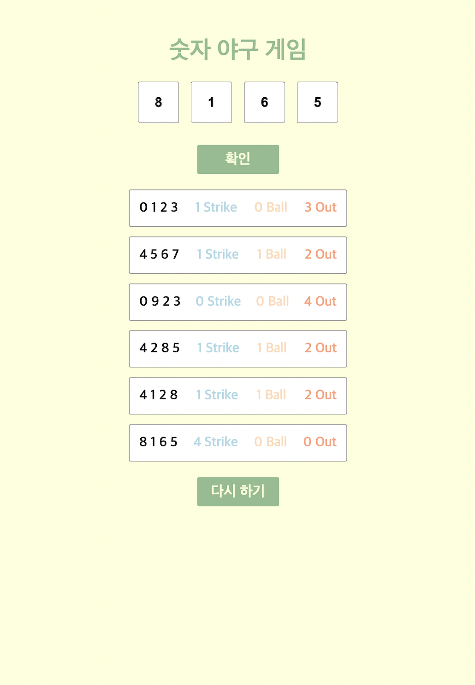
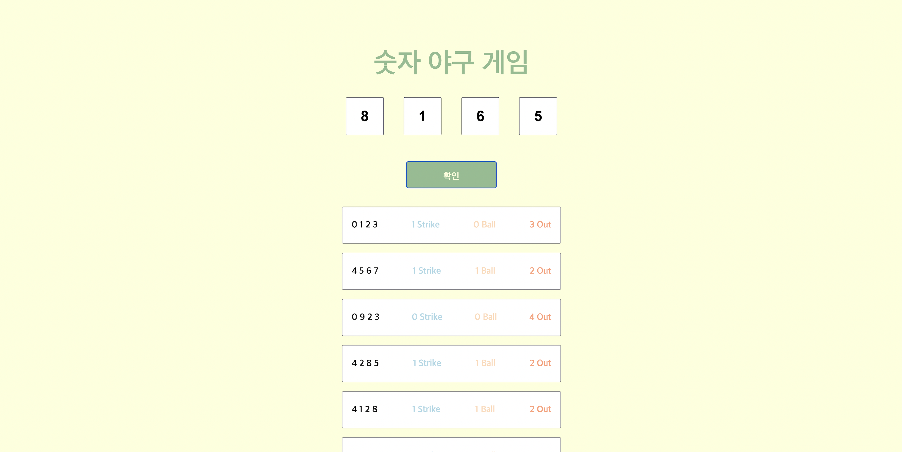

# 숫자 야구 웹 프로젝트 with </a>

### 프로젝트 설명

> 바닐라 자바스크립트와 미디어 쿼리를 연습하기 위해
> 수행한 숫자 야구 웹 프로젝트입니다.

### 실행 방법

> 해당 프로젝트는 https://sieukim.github.io/bulls-and-cows/ 에서 확인할 수 있습니다.

> 로컬 컴퓨터에서 실행하는 경우에는 `npm i`를 통해 프로젝트 실행에 필요한 라이브러리를 설치한 후
> `npm run build`를 통해 실행할 수 있습니다.

### 실행 화면

    
    <h3>mobile 화면</h3>
    
    <h3>tablet 화면</h3>
    
    <h3>web 화면</h3>

### 숫자 야구 게임 규칙

**정답 조건**

1. 정답은 1000부터 9999까지의 4자리 숫자이다.
2. 숫자와 위치를 맞는 경우엔 **Strike**이다.
3. 숫자만 맞는 경우엔 **Ball**이다.
4. 숫자와 위치 모두 틀린 경우엔 **Out**이다.

**입력 조건**

1. 0부터 9까지의 숫자를 이용하여 각 자리 수가 중복되지 않는 4자리 수를 입력한다.

### 프로젝트 후기

> https://talking-potato.me/64